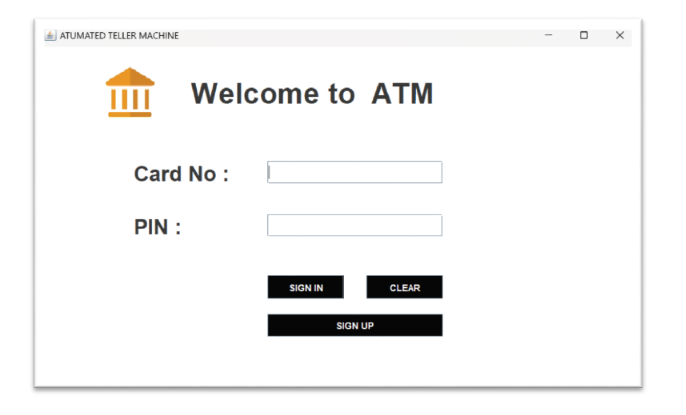
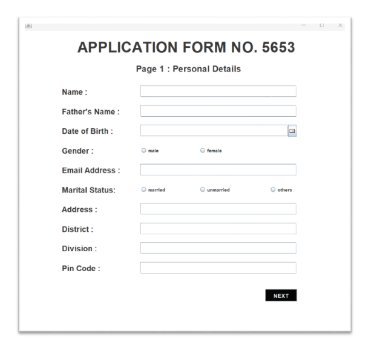
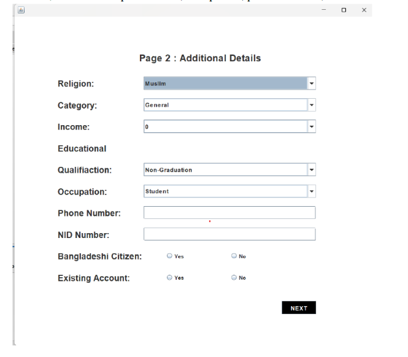
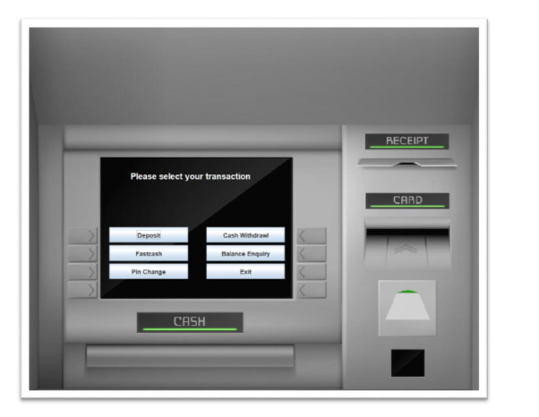
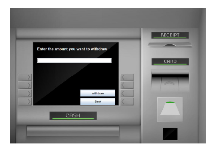
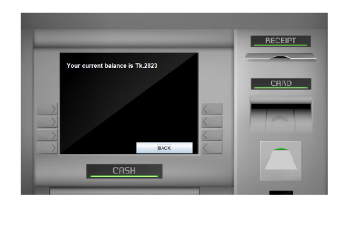

# ATM Simulator System

A Java Swing desktop application that simulates an ATM banking system with account registration, card-based login, balance enquiry, deposits, withdrawals, fast cash, PIN changes, and transaction history.

The application uses **Java Swing** for the graphical user interface, **MySQL** for persistent data storage, and **JDBC** for database connectivity.

## Project Overview

The complete NetBeans project is available in:

- [ATM-Simulator-System](ATM-Simulator-System)

The application uses a local MySQL database named `atmsimulatorsystem` to store user and transaction information.

## Features

- Multi-step account registration
- Card number and PIN authentication
- Balance enquiry
- Cash deposit
- Cash withdrawal
- Fast cash transactions
- PIN change
- Transaction history
- MySQL database integration
- Interactive desktop GUI

## Screenshots

### Login



### Account Registration




### ATM Transaction Menu



### Deposit


### Withdrawal



### Balance Enquiry



## Tech Stack

| Category              | Technology |
| --------------------- | ---------- |
| Programming Language  | Java       |
| GUI                   | Java Swing |
| Database              | MySQL      |
| Database Connectivity | JDBC       |
| Build Tool            | Apache Ant |
| IDE                   | NetBeans   |

## Database

The application uses the following MySQL database:

```text
Database: atmsimulatorsystem
```

The database contains tables for user registration and banking transactions, including:

- `login`
- `signup`
- `signuptwo`
- `signupThree`
- `bank`

The database schema is provided in:

- [ATM-Simulator-System/database.sql](ATM-Simulator-System/database.sql)

## Database Configuration

The database connection is configured in:

- [ATM-Simulator-System/src/atm/simulator/system/Conn.java](ATM-Simulator-System/src/atm/simulator/system/Conn.java)

Update the database credentials according to your local MySQL configuration.

Example:

```java
jdbc:mysql:///atmsimulatorsystem
username: root
password: <your-mysql-password>
```

## Requirements

Before running the project, install:

- JDK 8 or later
- MySQL Server
- MySQL Connector/J
- NetBeans IDE

## Setup Instructions

### 1. Clone the Repository

```bash
git clone <repository-url>
cd <repository-folder>
```

### 2. Create the Database

Start your MySQL server and execute the provided SQL script:

```bash
mysql -u root -p < ATM-Simulator-System/database.sql
```

Alternatively, import `database.sql` using MySQL Workbench.

### 3. Configure JDBC

Make sure the **MySQL Connector/J** library is available to the project.

If required, place the connector JAR file in:

```text
ATM-Simulator-System/lib/
```

Then ensure the library is included in the NetBeans project configuration.

### 4. Configure Database Credentials

Open:

```text
ATM-Simulator-System/src/atm/simulator/system/Conn.java
```

and update the MySQL username and password according to your local environment.

### 5. Run the Application

1. Open NetBeans.
2. Open the `ATM-Simulator-System` project.
3. Make sure the MySQL Connector/J dependency is resolved.
4. Start the MySQL server.
5. Run the project.

The application starts from:

```text
atm.simulator.system.Login
```

## Main Entry Point

The application starts from:

```text
atm.simulator.system.Login
```

The `Login` class contains the `main` method and launches the initial ATM login interface.

## Team

This project was developed as part of the **Object Oriented Programming (CSE-2102)** course at the **Department of Computer Science and Engineering, University of Dhaka**.

### Contributors

- **Tawyabul Islam Tamim**
- **Ovijit Chandra Balo**
- **Abdullah Al Arman Emon**

## Contact

**Tawyabul Islam Tamim**

Email: [tawyabulislamtamim@gmail.com](mailto:tawyabulislamtamim@gmail.com)

## License

This project is intended for educational and learning purposes.
